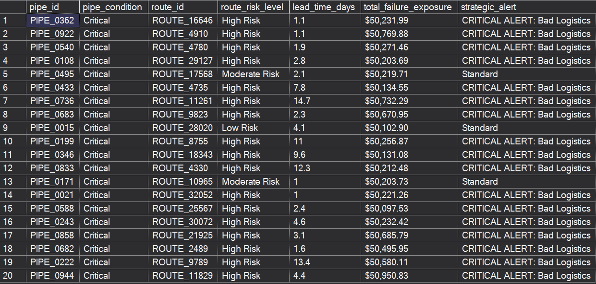

<h1 align="center">Pipeline & Supply Chain Risk Audit</h1>
<h3 align="center"><i>Preventing Infrastructure Failure via SQL & Python Analytics</i></h3>

  
  
  

 

<table align="center">
  <tr>
    <td width="1000">
      <h2 align="center">Executive Summary</h2>
      <body>
        <strong>The Business Challenge:</strong> Our infrastructure network faces significant financial exposure due to unforeseen pipeline failures. With a <strong>contractual delay penalty of $50,000 per incident</strong>, the cost of inefficient maintenance logistics is substantial.
          
        <strong>The Solution:</strong> I engineered an end-to-end audit pipeline using <strong>Python (ETL)</strong> and <strong>SQL (Risk Logic)</strong>. By joining operational sensor data with supply chain logs, I simulated the financial risk of every active shipment to identify strategic process failures.
      </body>
      <h3>Northstar Metrics (SQL Calculated)</h3>
      <h4>
        <ul>
            <li><strong>Total Failure Exposure ($):</strong> The combined financial liability of shipping fees plus the probabilistic risk of delay penalties.</li>
            <li><strong>Strategic Misalignment Rate:</strong> The percentage of "Critical" condition pipes assigned to "High-Risk" logistics routes.</li>
            <li><strong>Compound Risk Events:</strong> Instances where a high-probability mechanical failure coincides with a high-probability logistical delay.</li>
        </ul>
      </h4>
    </td>
  </tr>
</table>

<table align="center">
  <tr>
    

      <h1 align="center">The SQL Audit Results</h1>      
      

        
      
      
      <td width="460" valign="top">
        <h3>1. Strategic Risk Misalignment</h3>
        <ul>
            <li><strong>The Finding:</strong> The SQL audit identified a critical process gap: <strong>90% of Critical condition pipes</strong> were assigned to <strong>High-Risk shipping routes</strong>.</li>
            <li><strong>The Logic:</strong> I utilized a <code>CASE WHEN</code> statement to flag rows where the operational urgency (Critical) conflicted with the logistical reliability (High Risk).</li>
            <li><strong>The Impact:</strong> This misalignment exposes the company to an estimated <strong>$1M+ in potential penalties</strong> (20 pipes × $50k) for the audited batch.</li>
        </ul>
      </td>      
      <td width="460" valign="top">
        <h3>2. Cost vs. Risk Disparity</h3>
        <ul>
            <li><strong>The Analysis:</strong> The audit compared standard shipping costs (~$200) against the potential delay penalty ($50,000).</li>
            <li><strong>The Finding:</strong> The <em>Total Failure Exposure</em> remained consistently high (~$50,200) regardless of the carrier used, indicating that shipping cost is a negligible factor in overall risk.</li>
            <li><strong>Conclusion:</strong> Prioritizing low shipping costs is financially inefficient. The liability risk outweighs the shipping savings by a factor of <strong>250:1</strong>.</li>
        </ul>
      </td>
    

  </tr>
</table>

<h1 align="center">Strategic Recommendations</h1>

<table align="center">
    <tr>
        <td width="333" valign="top">
            <h3> 1. Risk-Based Routing Protocol</h3>
            <ul>
                <li><strong>Observation:</strong> Critical pipes are currently defaulting to High-Risk carriers due to cost optimization algorithms.</li>
                <li><strong>Action:</strong> Implement a hard logic rule in the logistics system: <code>IF Condition = 'Critical' THEN Max_Risk = 'Low'</code>.</li>
                <li><strong>Impact:</strong> Eliminates compound risk scenarios and ensures high-priority maintenance is not delayed.</li>
            </ul>
        </td>
        <td width="333" valign="top">
            <h3> 2. Premium Shipping Policy</h3>
            <ul>
                <li><strong>Observation:</strong> The $50k penalty is the dominant cost driver.</li>
                <li><strong>Action:</strong> Automatically upgrade all Critical orders to <strong>Air Freight / Premium Ground</strong>.</li>
                <li><strong>Impact:</strong> The additional cost (~$500) functions as a necessary insurance premium to mitigate the $50,000 liability exposure.</li>
            </ul>
        </td>
        <td width="333" valign="top">
            <h3> 3. Short-Haul Vendor Audit</h3>
            <ul>
                <li><strong>Observation:</strong> The data revealed elevated risk scores even on short-haul routes (1-3 days lead time).</li>
                <li><strong>Action:</strong> Initiate a performance review for local short-haul carriers.</li>
                <li><strong>Impact:</strong> Identify if the risk stems from specific operational inefficiencies (e.g., handling, traffic, or theft) rather than distance.</li>
            </ul>
        </td>
    </tr>
</table>
